# 🕵️ GraphDB Trade Surveillance System

## 📋 Table of Contents
- [Business Problem & Solution](#business-problem--solution)
- [Application Architecture](#application-architecture)
- [Graph Database Structure](#graph-database-structure)
- [Trading Pattern Detection](#trading-pattern-detection)
- [User Interface Overview](#user-interface-overview)
- [Installation & Setup](#installation--setup)
- [How to Run](#how-to-run)
- [Known Issues](#known-issues)
- [Technology Overview](#technology-overview)
- [Development Tools](#development-tools)

---

## 🎯 Business Problem & Solution

### The Business Problem

Financial markets are constantly under threat from **market manipulation** and **illegal trading practices**. Traditional surveillance systems struggle to detect sophisticated patterns of suspicious activity because they:

- **Lack context**: Cannot see relationships between traders, accounts, and transactions
- **Miss complex patterns**: Fail to identify multi-step manipulation schemes
- **Generate false positives**: Create too much noise for compliance teams
- **React slowly**: Take too long to identify and respond to threats

### Our Solution

This project leverages **Graph Database technology** and **Agentic AI** to solve these challenges:

🔍 **Graph-Based Detection**: Uses Neo4j to model relationships between Traders, Accounts, Transactions, and Securities, enabling detection of complex manipulation patterns

🤖 **Intelligent Agents**: Employs LangGraph agents that continuously monitor trading activity with reasoning capabilities

🧠 **AI-Powered Analysis**: Uses advanced pattern recognition to distinguish between legitimate trading and suspicious behavior

⚡ **Real-Time Monitoring**: Provides immediate detection and alerting of suspicious patterns

📊 **Natural Language Interface**: Allows compliance officers to query the system using plain English

---

## 🏗️ Application Architecture

### Agentic AI Workflow

```mermaid
graph LR
    subgraph DS ["📊 Data Sources Layer"]
        direction TB
        TD["💼 Trading Data<br/>• Orders<br/>• Executions<br/>• Cancellations"]
        MD["📈 Market Data<br/>• Prices<br/>• Volumes<br/>• Timestamps"]
        AD["🏦 Account Data<br/>• Trader Info<br/>• Account Details<br/>• Risk Profiles"]
    end
    
    subgraph DB ["🗄️ Graph Database"]
        direction TB
        NEO["🔗 Neo4j GraphDB<br/>• Nodes: Trader, Account,<br/>  Transaction, Security<br/>• Relationships: PLACED_BY,<br/>  PLACED, INVOLVES,<br/>  CONNECTED_TO"]
    end
    
    subgraph AI ["🤖 AI Agents & Intelligence Layer"]
        direction TB
        
        subgraph SA ["🕵️ Surveillance Agent"]
            direction TB
            SAM["👁️ Monitor<br/>Continuous scanning<br/>of trading activity"]
            SAA["🧠 Analyze<br/>Pattern recognition<br/>& anomaly detection"]
            SAD["🎯 Decide<br/>Confidence scoring<br/>& severity assessment"]
            SAE["📢 Escalate<br/>Alert generation<br/>& routing"]
            
            SAM --> SAA --> SAD --> SAE
        end
        
        subgraph PD ["🔍 Pattern Detection Tools"]
            direction TB
            SPD["🎭 Spoofing Detector<br/>• Large order placement<br/>• Quick cancellations<br/>• Market manipulation"]
            LAD["🔄 Layering Detector<br/>• Multiple order levels<br/>• Connected transactions<br/>• False depth creation"]
        end
        
        subgraph NLP ["💬 NLP Agent"]
            direction TB
            QT["🔤 Query Translator<br/>Natural language<br/>to Cypher conversion"]
            SC["📋 Schema Analyzer<br/>Database structure<br/>understanding"]
            RF["📝 Result Formatter<br/>Human-readable<br/>output generation"]
            
            QT --> SC --> RF
        end
    end
    
    subgraph BE ["⚙️ Backend Services Layer"]
        direction TB
        
        subgraph API ["🌐 FastAPI Server"]
            direction TB
            PDA["🔍 Pattern Detection API<br/>• Real-time monitoring<br/>• Historical analysis<br/>• Confidence scoring"]
            MA["📊 Monitoring API<br/>• Agent status<br/>• System health<br/>• Configuration"]
            QIA["💭 Query Interface API<br/>• NLP processing<br/>• Cypher execution<br/>• Result formatting"]
            DA["📈 Dashboard API<br/>• Statistics aggregation<br/>• Live data feeds<br/>• Performance metrics"]
        end
    end
    
    subgraph FE ["🖥️ Frontend Application Layer"]
        direction TB
        
        subgraph UI ["⚛️ React Dashboard"]
            direction TB
            PV["🎯 Pattern Viewer<br/>• Suspicious activity list<br/>• Detailed analysis<br/>• Network diagrams"]
            QI["🗨️ Query Interface<br/>• Natural language input<br/>• Query results<br/>• Cypher display"]
            MC["⚙️ Monitoring Console<br/>• Agent controls<br/>• System configuration<br/>• Real-time status"]
            AM["🚨 Alert Manager<br/>• Alert dashboard<br/>• Status tracking<br/>• Historical data"]
        end
    end
    
    %% Data Flow Connections
    TD --> NEO
    MD --> NEO
    AD --> NEO
    
    NEO -->|"🔄 Continuous<br/>Data Access"| SAM
    NEO -->|"📊 Schema<br/>Discovery"| SC
    
    SAA --> SPD
    SAA --> LAD
    
    SPD -->|"⚠️ Patterns<br/>Detected"| SAD
    LAD -->|"⚠️ Patterns<br/>Detected"| SAD
    
    SAE --> PDA
    RF --> QIA
    
    PDA -->|"📊 Pattern<br/>Data"| PV
    MA -->|"📈 System<br/>Status"| MC
    QIA -->|"💭 Query<br/>Results"| QI
    DA -->|"📊 Dashboard<br/>Data"| AM
    
    %% Styling
    classDef dataSource fill:#e3f2fd,stroke:#1976d2,stroke-width:2px
    classDef database fill:#f3e5f5,stroke:#7b1fa2,stroke-width:3px
    classDef agent fill:#fff3e0,stroke:#f57c00,stroke-width:2px
    classDef backend fill:#e8f5e8,stroke:#388e3c,stroke-width:2px
    classDef frontend fill:#fce4ec,stroke:#c2185b,stroke-width:2px
    
    class TD,MD,AD dataSource
    class NEO database
    class SAM,SAA,SAD,SAE,SPD,LAD,QT,SC,RF agent
    class PDA,MA,QIA,DA backend
    class PV,QI,MC,AM frontend
```



### Agent Architecture Details

#### 🤖 Surveillance Agent
- **Role**: Continuous monitoring and pattern detection
- **Tools**: Database queries, pattern analyzers, confidence calculators
- **Workflow**: Monitor → Detect → Analyze → Score → Escalate
- **Decision Making**: Uses confidence thresholds and severity levels

#### 🧠 NLP Agent  
- **Role**: Natural language query processing
- **Tools**: Schema discovery, query generation, result formatting
- **Workflow**: Parse → Understand → Generate → Execute → Format
- **Decision Making**: Schema-aware query optimization

---

## 🗄️ Graph Database Structure

### Node Types & Relationships

```mermaid
graph LR
    subgraph "Core Entities"
        A[👤 Trader] 
        B[🏦 Account]
        C[💼 Transaction]
        D[📈 Security]
    end
    
    A -->|PLACED_BY| C
    B -->|PLACED| C
    C -->|INVOLVES| D
    C -->|CONNECTED_TO| C
    
    style A fill:#e1f5fe
    style B fill:#f3e5f5  
    style C fill:#fff3e0
    style D fill:#e8f5e8
```



### Node Properties

| Node Type | Properties | Description |
|-----------|------------|-------------|
| **Trader** | `trader_id`, `name` | Individual traders in the system |
| **Account** | `account_id`, `account_type` | Trading accounts |
| **Transaction** | `transaction_id`, `side`, `quantity`, `price`, `timestamp`, `status`, `venue` | Individual trading transactions |
| **Security** | `symbol`, `cusip`, `instrument_type` | Financial instruments being traded |

### Key Relationships

- **`PLACED_BY`**: Links transactions to the traders who executed them
- **`PLACED`**: Links transactions to the accounts they were executed from  
- **`INVOLVES`**: Links transactions to the securities being traded
- **`CONNECTED_TO`**: Links related transactions (crucial for layering detection)

---

## 🎭 Trading Pattern Detection

### Layering Pattern Example

**Definition**: Layering involves placing multiple orders at different price levels to create false market depth and manipulate prices.


**Detection Logic**:
1. Multiple transactions from same trader/account
2. Same security (AAPL) across transactions
3. Connected chain of transactions (CONNECTED_TO relationships)
4. Decreasing quantities at different price levels
5. High confidence score based on pattern characteristics

### Spoofing Pattern Example  

**Definition**: Spoofing involves placing and quickly canceling orders to mislead other market participants about supply and demand.

```mermaid
graph TB
    subgraph "Spoofing Detection Example"
        A[👤 Trader: TR002]
        B[🏦 Account: ACC002] 
        
        A -->|PLACED_BY| C[💼 TX004: SELL 5000@$101.00<br/>Status: CANCELLED]
        A -->|PLACED_BY| D[💼 TX005: SELL 3000@$101.50<br/>Status: CANCELLED]
        
        B -->|PLACED| C
        B -->|PLACED| D
        
        C -->|INVOLVES| E[📈 MSFT]
        D -->|INVOLVES| E
        
        F[🚨 Pattern: SPOOFING<br/>Confidence: 92%<br/>Severity: CRITICAL]
    end
    
    style A fill:#e1f5fe
    style B fill:#f3e5f5
    style C fill:#fff3e0
    style D fill:#fff3e0
    style E fill:#e8f5e8
    style F fill:#ffebee
```



**Detection Logic**:
1. Large orders placed and quickly cancelled
2. High frequency of cancellations vs. executions
3. Orders placed away from market price
4. Pattern of deceptive market behavior
5. Very high confidence score due to clear manipulation intent

---

## 🖥️ User Interface Overview

### Dashboard


The **Dashboard** provides a real-time overview of the surveillance system:
- **Live Statistics**: Total patterns detected, high confidence patterns, unique traders
- **Pattern Distribution**: Visual charts showing spoofing vs layering patterns
- **System Status**: Monitoring agent status and last update times
- **Quick Actions**: Direct access to pattern details and monitoring controls

### Suspicious Patterns Page


The **Patterns Page** shows all detected suspicious activities:
- **Advanced Filtering**: Filter by pattern type, trader, account, instrument, and severity
- **Comprehensive Table**: Shows pattern type, trader ID, account, instrument, confidence, severity, and timestamp
- **Interactive Rows**: Click any pattern to view detailed information
- **Real-time Updates**: Automatically refreshes with new detections

### Pattern Details Modal - Network Diagram


The **Pattern Details** modal provides in-depth analysis:
- **Network Diagram**: Visual representation of trader, account, transaction, and security relationships
- **Relationship Mapping**: Shows PLACED_BY, PLACED, INVOLVES, and CONNECTED_TO relationships
- **Interactive Visualization**: Color-coded nodes for easy identification

### Pattern Details Modal - Information Sections  


**Detailed Information Sections**:
- **Pattern Information**: Type, trader, account, instrument, confidence, severity, timestamp, description
- **Trader Details**: Complete trader profile information
- **Account Details**: Full account information and properties
- **Security Details**: Instrument specifications and metadata

### Pattern Details Modal - Transaction Analysis


**Transaction Analysis**:
- **Transaction Details**: Complete transaction information with properly formatted timestamps
- **Related Transaction IDs**: Summary of all transactions involved in the pattern
- **Scrollable Interface**: Handle large numbers of transactions efficiently

### Natural Language Query Interface - Top


**Query Interface Features**:
- **Natural Language Input**: Ask questions in plain English
- **Real-time Processing**: Convert natural language to Cypher queries
- **Example Queries**: Helpful suggestions for common surveillance questions

### Natural Language Query Interface - Results


**Query Results**:
- **Generated Cypher**: Shows the automatically generated database query
- **Confidence Score**: Indicates how well the system understood the question
- **Formatted Results**: Clean, readable output of query results
- **Error Handling**: Clear error messages for invalid queries

### Monitoring Console


**System Monitoring**:
- **Agent Status**: Real-time status of surveillance agents
- **Configuration**: Adjust detection parameters and thresholds
- **Manual Controls**: Trigger surveillance cycles and system actions
- **Performance Metrics**: System health and performance indicators

### Alerts Management


**Alert System**:
- **Alert Dashboard**: Comprehensive view of all system alerts
- **Severity Levels**: Color-coded alerts by importance
- **Status Tracking**: Monitor alert resolution and follow-up actions
- **Historical Data**: Review past alerts and patterns

---

## 🚀 Installation & Setup

### Prerequisites

- **Neo4j Database**: Version 4.0+ with APOC plugin
- **Python**: Version 3.8+
- **Node.js**: Version 16+
- **OpenAI API Key**: For natural language processing

### 1. Clone Repository

```bash
git clone <repository-url>
cd graphdb-trade-surveillance
```

### 2. Backend Setup

```bash
cd backend

# Create virtual environment
python -m venv venv

# Activate virtual environment
# Windows:
venv\Scripts\activate
# macOS/Linux:
source venv/bin/activate

# Install dependencies
pip install -r requirements.txt

# Configure environment variables
cp env.example .env
# Edit .env with your Neo4j and OpenAI credentials
```

### 3. Frontend Setup

```bash
cd frontend

# Install dependencies
npm install

# Start development server
npm start
```

### 4. Database Setup

Ensure your Neo4j database contains:
- Trader nodes with properties: `trader_id`, `name`, `firm`
- Account nodes with properties: `account_id`, `account_type`
- Transaction nodes with properties: `transaction_id`, `side`, `quantity`, `price`, `timestamp`, `status`
- Security nodes with properties: `symbol`, `cusip`, `instrument_type`
- Appropriate relationships: `PLACED_BY`, `PLACED`, `INVOLVES`, `CONNECTED_TO`

---

## 🏃‍♂️ How to Run

### Quick Start Script

```bash
# Use the provided start script
./start.sh
```

### Manual Start

**Terminal 1 - Backend**:
```bash
cd backend
python main.py
# Server starts on http://localhost:8000
```

**Terminal 2 - Frontend**:
```bash
cd frontend
npm start  
# Application starts on http://localhost:3000
```

### Running Individual Tools

**Pattern Detection**:
```bash
cd backend
python -c "from pattern_detection.adaptive_detectors import adaptive_detector; print(adaptive_detector.detect_all_patterns(24))"
```

**Schema Discovery**:
```bash
cd backend
python -c "from database.schema_discovery import schema_discovery; print(schema_discovery.discover_full_schema())"
```

**NLP Query Testing**:
```bash
cd backend
python -c "from nlp_to_cypher.translator import translate_to_cypher; print(translate_to_cypher('Show me all traders'))"
```

---

## ⚠️ Known Issues

### Current Limitations

1. **Performance**: Large datasets may slow down pattern detection
   - **Workaround**: Adjust lookback hours in detection queries
   - **Future Fix**: Implement query optimization and caching

2. **Memory Usage**: Long-running surveillance agents may consume memory
   - **Workaround**: Restart agents periodically
   - **Future Fix**: Implement memory management and garbage collection

3. **Neo4j DateTime Formatting**: Complex timestamp objects in transaction details
   - **Status**: Recently fixed with enhanced formatValue function
   - **Impact**: Minimal - timestamps now display correctly

### Browser Compatibility

- **Chrome**: Fully supported ✅
- **Firefox**: Fully supported ✅  
- **Safari**: Mostly supported (minor CSS differences)
- **Edge**: Fully supported ✅

### Network Requirements

- **Backend API**: Requires access to port 8000
- **Neo4j Database**: Requires bolt connection on port 7687
- **OpenAI API**: Requires internet access for NLP features

---

## 📚 Technology Overview

### 🤖 Introduction to Agentic AI

**Agentic AI** represents a paradigm shift from traditional AI systems to autonomous agents that can:

- **Reason**: Make decisions based on goals and context
- **Plan**: Break down complex tasks into manageable steps  
- **Act**: Execute actions using available tools
- **Reflect**: Learn from outcomes and adjust behavior

In our surveillance system, agents continuously monitor trading data, make intelligent decisions about suspicious patterns, and escalate alerts based on confidence levels and business rules.

**Key Benefits**:
- **Autonomous Operation**: Runs 24/7 without human intervention
- **Intelligent Decision Making**: Adapts to new patterns and scenarios
- **Context Awareness**: Understands the broader market context
- **Continuous Learning**: Improves detection accuracy over time

### 🔗 Introduction to LangGraph

**LangGraph** is a framework for building stateful, multi-actor applications with Large Language Models (LLMs). It enables:

- **State Management**: Maintains conversation and decision state across interactions
- **Multi-Agent Orchestration**: Coordinates multiple AI agents working together
- **Tool Integration**: Seamlessly connects LLMs with external tools and APIs
- **Workflow Definition**: Creates complex, branching decision workflows

In our system, LangGraph powers:
- **Surveillance Agent**: Monitors and analyzes trading patterns
- **NLP Agent**: Translates natural language to database queries
- **Escalation Workflows**: Manages alert prioritization and routing

**Architecture Benefits**:
- **Modularity**: Each agent has specific responsibilities
- **Scalability**: Easy to add new agents and capabilities
- **Reliability**: Built-in error handling and recovery
- **Transparency**: Clear audit trail of agent decisions

### 🕸️ Introduction to Graph Databases

**Graph Databases** excel at managing connected data by storing relationships as first-class citizens:

**Traditional vs Graph Approach**:

| Traditional Database | Graph Database |
|---------------------|----------------|
| Tables with foreign keys | Nodes with direct relationships |
| JOIN operations required | Native relationship traversal |
| Performance degrades with complexity | Performance scales with relationships |
| Schema changes are expensive | Schema evolution is natural |

**Why Graphs for Financial Surveillance**:

1. **Relationship Modeling**: Natural representation of trader-account-transaction relationships
2. **Pattern Detection**: Efficient traversal of connected suspicious activities  
3. **Real-time Queries**: Fast relationship-based queries for live monitoring
4. **Data Integration**: Easy connection of disparate financial data sources

**Neo4j Advantages**:
- **ACID Compliance**: Ensures data consistency in financial applications
- **Cypher Query Language**: Intuitive, SQL-like syntax for graph queries
- **Scalability**: Handles billions of nodes and relationships
- **Visualization**: Built-in tools for exploring data relationships

### 🛠️ Other Frameworks Used

| Technology | Purpose | Why We Chose It |
|------------|---------|----------------|
| **FastAPI** | Backend API framework | High performance, automatic API docs, async support |
| **React** | Frontend framework | Component-based, large ecosystem, TypeScript support |
| **TypeScript** | Type-safe JavaScript | Better developer experience, fewer runtime errors |
| **Tailwind CSS** | Utility-first CSS | Rapid styling, consistent design system |
| **Pydantic** | Data validation | Type-safe data models, automatic validation |
| **OpenAI GPT-4** | Natural language processing | State-of-the-art language understanding |
| **Recharts** | Data visualization | React-native charts, responsive design |

---

## 🔧 Development Tools

### 💻 Introduction to Cursor

**Cursor** is an AI-powered code editor built specifically for AI-assisted development:

**Key Features**:
- **AI Pair Programming**: Real-time code suggestions and completions
- **Codebase Understanding**: AI that understands your entire project context
- **Natural Language Coding**: Write code using natural language descriptions
- **Smart Refactoring**: AI-assisted code improvements and optimizations
- **Bug Detection**: Proactive identification of potential issues

**How We Used Cursor**:
- **Pattern Detection Logic**: AI helped design complex graph traversal algorithms
- **UI Component Development**: Rapid prototyping of React components
- **API Integration**: Streamlined backend-frontend connection
- **Error Handling**: Comprehensive error management across the stack
- **Documentation**: AI-assisted generation of code documentation

### 🆚 Cursor vs Other AI Code Tools

| Feature | Cursor | GitHub Copilot | CodeT5 | Tabnine |
|---------|--------|----------------|---------|---------|
| **Codebase Awareness** | ✅ Full project context | ❌ Limited context | ❌ Limited context | ⚠️ Partial context |
| **Natural Language** | ✅ Code from descriptions | ⚠️ Comments to code | ⚠️ Limited NL support | ❌ No NL support |
| **Multi-file Editing** | ✅ Cross-file changes | ❌ Single file focus | ❌ Single file focus | ❌ Single file focus |
| **Custom Models** | ✅ Multiple AI models | ❌ Fixed model | ⚠️ Some customization | ⚠️ Some customization |
| **Debugging Assistance** | ✅ AI-powered debugging | ⚠️ Limited debugging | ❌ No debugging | ❌ No debugging |
| **Learning Curve** | 🟢 Intuitive | 🟢 Easy | 🟡 Moderate | 🟢 Easy |
| **Performance** | 🟢 Fast | 🟢 Fast | 🟡 Moderate | 🟢 Fast |

**Why Cursor Excelled for This Project**:

1. **Complex Architecture Understanding**: Cursor grasped the multi-agent, graph database architecture immediately
2. **Cross-Technology Support**: Seamlessly worked across Python, TypeScript, and database queries
3. **Pattern Recognition**: Helped identify and implement sophisticated trading pattern detection algorithms
4. **Rapid Iteration**: Enabled quick prototyping and testing of surveillance features
5. **Documentation Generation**: Assisted in creating comprehensive project documentation

**Unique Advantages**:
- **Contextual Intelligence**: Understands how changes in one part affect the entire system
- **Architectural Awareness**: Suggests improvements that align with overall system design
- **Domain Knowledge**: Leverages understanding of financial surveillance concepts
- **Quality Assurance**: Proactively suggests error handling and edge case management

---

## 🤝 Contributing

We welcome contributions! Please see our contributing guidelines and feel free to submit issues and pull requests.

## 📄 License

This project is licensed under the MIT License - see the [LICENSE](LICENSE) file for details.

---

**Built with ❤️ using Agentic AI, Graph Databases, and Modern Web Technologies**
